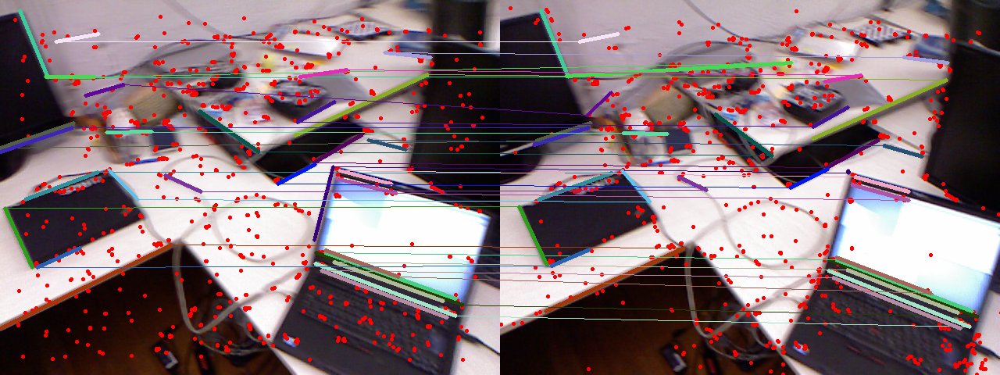
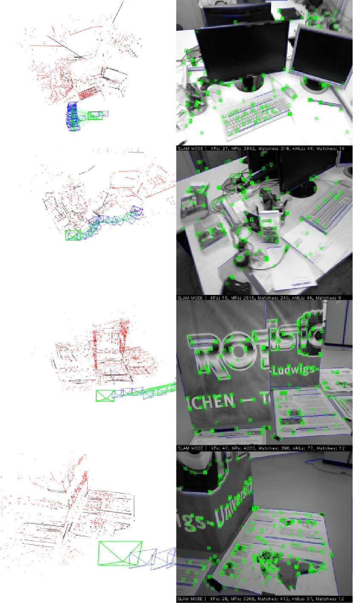

# Enhancing RGB-D SLAM with Point-Line Feature Fusion and LK Optical Flow for Indoor Environments

## Overview

This repository contains an enhanced RGB-D SLAM algorithm that integrates point and line features using the Lucas-Kanade (LK) optical flow method, tailored for indoor environments. Our approach significantly improves positioning accuracy and robustness compared to traditional VSLAM methods.


## Key Features

- **Point-Line Feature Fusion**: Combines point and line features for enhanced pose estimation.
- **LK Optical Flow Tracking**: Efficient keyframe selection to reduce computational load.
- **LSD+LBD Line Extraction**: Utilizes advanced techniques for reliable line feature extraction.
- **Performance**: Demonstrated improvements in stability and accuracy on the TUM RGB-D dataset.

## Installation

To set up the project, clone this repository and install the required dependencies.

```bash
git clone https://github.com/Yu-Linbo/ORB_SLAM_add_line.git
cd ORB_SLAM_add_line
./build.sh
./build_ros.sh

# Running RGB_D Node
rosrun ORB_SLAM2 RGBD PATH_TO_VOCABULARY PATH_TO_SETTINGS_FILE
```

## Image
### KeyFrame to KeyFrame


### Running
