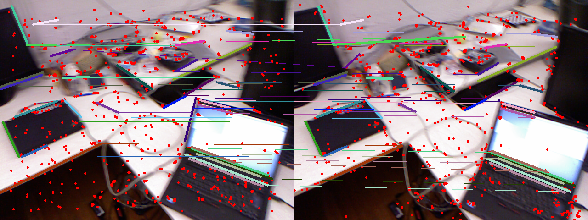
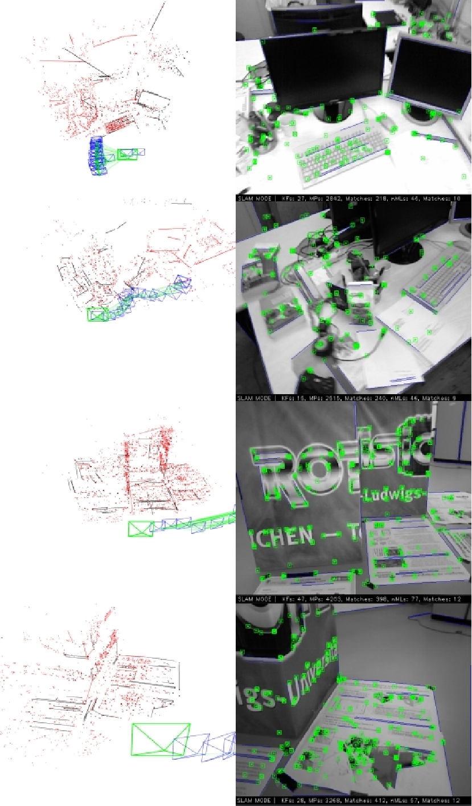

# Enhancing RGB-D SLAM with Point-Line Feature Fusion and LK Optical Flow for Indoor Environments

## Overview

This repository contains an enhanced RGB-D SLAM algorithm that integrates point and line features using the Lucas-Kanade (LK) optical flow method, tailored for indoor environments. This code is modified from [ORB-SLAM2](https://github.com/raulmur/ORB_SLAM2) and significantly improves positioning accuracy and robustness compared to traditional VSLAM methods.


## Key Features

- **Point-Line Feature Fusion**: Combines point and line features for enhanced pose estimation.
- **LK Optical Flow Tracking**: Efficient keyframe selection to reduce computational load.
- **LSD+LBD Line Extraction**: Utilizes advanced techniques for reliable line feature extraction.
- **Performance**: Demonstrated improvements in stability and accuracy on the TUM RGB-D dataset.

## Dependencies

- Ubuntu 20.04
- ROS 1 noetic
- OpenCV 3.2.0
- Other configurations are the same as ORB-SLAM2.

## Installation and Usage

To set up the project, clone this repository and install the required dependencies.

```bash
git clone https://github.com/Yu-Linbo/ORB_SLAM_add_line.git
cd ORB_SLAM_add_line
./build.sh
./build_ros.sh

# Running with dataset
./Examples/RGB-D/rgbd_tum Vocabulary/ORBvoc.txt Examples/RGB-D/TUMX.yaml PATH_TO_SEQUENCE_FOLDER ASSOCIATIONS_FILE

# Running with real rgbd camera
rosrun ORB_SLAM2 RGBD PATH_TO_VOCABULARY PATH_TO_SETTINGS_FILE
```

Note: If you are using a real camera, please ensure that camera calibration is performed in advance and that the topic names match.

## Data Availability

The datasets used in this study, TUM RGB-D, can be accessed at [TUM RGB-D Dataset](https://cvg.cit.tum.de/data/datasets/rgbd-dataset/download). The source code is available at [GitHub Repository](https://github.com/Yu-Linbo/ORB_SLAM_add_line). For any inquiries, please open a GitHub issue or email the author.

## Image
### KeyFrame to KeyFrame


### Running
